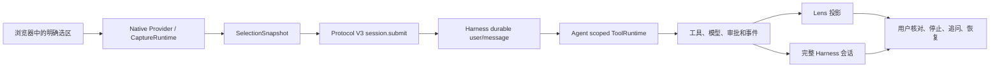

# Harness-plugins 后续 Codex 开发任务指南

本指南把 [完整交互开发计划](harness-integration-development-plan.md) 和根目录的 [Harness-plugins 任务手册](../harness-plugins%20task.md) 转换为后续 Codex 可以直接执行和审查的工作包。它面向当前 `feat/t05-session-integration` 工作线，覆盖 R04 到可与 DeepSeek Harness 完整交互的 R08。执行者必须以当前工作树、已安装依赖和实际 Harness 版本为准；本文不把计划中的接口或测试结果当作已经实现的事实。

审阅基线：2026-09-08，分支 `feat/t05-session-integration`。R04 自动化实现提交为 `5ec3a8a`；真实 profile、模型和可见窗口的产品证据尚未执行。执行者必须从当前 HEAD 开始，不允许重置到任何早期基线而覆盖后续工作。

## 目录

- [1. 最终目标与完成门槛](#1-最终目标与完成门槛)
- [2. 审阅时的真实状态](#2-审阅时的真实状态)
- [3. 固定架构与不可破坏的规则](#3-固定架构与不可破坏的规则)
- [4. 每个工作包的执行纪律](#4-每个工作包的执行纪律)
- [5. R04：持久材料与选区工具](#5-r04持久材料与选区工具)
- [6. R05：审批、追问与宿主交互](#6-r05审批追问与宿主交互)
- [7. R06：会话选择、历史与恢复](#7-r06会话选择历史与恢复)
- [8. R07：真实运行器与闭环证据](#8-r07真实运行器与闭环证据)
- [9. R08：来源、交互品质、安装与发布](#9-r08来源交互品质安装与发布)
- [10. 测试、证据和截图规范](#10-测试证据和截图规范)
- [11. 并行开发与工作树分工](#11-并行开发与工作树分工)
- [12. 风险、阻塞与升级规则](#12-风险阻塞与升级规则)
- [13. 可复制给 Codex 的提示词](#13-可复制给-codex-的提示词)

## 1. 最终目标与完成门槛

产品的首个完整浏览器闭环是：用户在 Chrome、Edge 或声明支持的 Chromium 浏览器中选择文本，以主动动作打开 Lens；Lens 固定该次材料，向同一 Harness session 提交解释、翻译或追问；Harness 的 Agent、工具、审批和会话日志成为唯一执行与持久化所有者；Lens 与完整 Harness 界面可以展示同一请求、回答、工具结果和历史；用户能够停止、恢复、核对来源，并返回原始阅读任务。

“感知增强”只指降低用户理解所选材料时的切换、记忆和误发成本。它不允许后台持续调用模型、擅自扩大网页范围、把采集完整度伪装成答案可信度，或建立与 Harness 并行的对话历史。

可靠 Harness 交互闭环的完成门槛是 R01 至 R07 全部满足：固定材料可从 durable session log 重建；工具只读取当前调用绑定的材料；审批和 ask-user 保持宿主身份与权限；会话历史在 Lens 和 Harness 中一致；Windows Named Pipe、真实 dsh profile、真实模型会话和可见 Tauri 交互各有独立证据。R08 完成后才可以称为适合日常使用的产品，因为来源范围、无障碍、视觉、人因、安装和候选验收仍然是产品质量的一部分。



## 2. 审阅时的真实状态

本节记录本次审阅工作树时看到的事实，用于决定下一步，不代替每个工作包完成后的证据。每次开始开发前都要再次运行 `git status --short`、读取当前 HEAD，并更新下表中的状态。

| 工作包 | 状态 | 现有证据或工作树事实 | 仍不能声明的结果 |
|---|---|---|---|
| R01 | 已完成自动验证 | `1f5107b` 与 `docs/evidence/r01-lens-session-projection.md` 记录 Lens 事件投影的单元和集成检查 | 真实 Tauri 窗口、浏览器选区和真实模型 |
| R02 | 已完成自动验证和 Windows 管道验证 | `c2e685e` 与 `docs/evidence/r02-continuous-session-subscriptions.md` 记录连续订阅、恢复和 Node/Rust Named Pipe | 真实 Harness profile 的整条产品路径 |
| R03 | 已完成自动验证和 Windows 管道验证 | `00ccb6a` 与 `docs/evidence/r03-request-identity-and-recovery.md` 记录幂等、未知提交恢复、取消竞态和持久回执 | scoped 选区工具、审批、真实模型、可见窗口 |
| R04 | 自动检查与 Windows 管道通过待实测 | `5ec3a8a`、[R04 证据](evidence/r04-session-bound-selection-tools.md)记录 V3 材料、Agent scoped 工具、TS/Rust/Native 同步和真实 Node/Rust Named Pipe | 受支持 profile 中的工具可见性、真实模型、可见 Tauri 窗口、截图和真实进程重启 |
| R05 | 宿主前置任务 H05 已识别 | [rc.2 API 审计](evidence/r05-host-api-audit.md)证明没有可恢复、可竞答的 pending interaction API；[H05](host-tasks/r05-durable-session-interactions.md)定义必须先发布的宿主能力 | 插件 IPC、Lens 决策 UI、真实 approval/ask-user 和自动批准能力 |
| R06 | 自动实现与聚焦验证完成 | [R06 实现证据](evidence/r06-session-history-implementation.md)记录 durable history 分页、Native 命令、Lens 选择/恢复、旧订阅释放和跨语言验证 | 受支持的完整 Harness 导航 API、真实 profile、可见窗口和真实进程重启证据 |
| R07 | 待开发 | `scripts/test-session-e2e.mjs` 和 `scripts/test-lens-e2e.mjs` 当前仍以退出码 2 表示未实现 | 真实模型、原生窗口、截图或完整产品 smoke |
| R08 | 待开发 | 任务手册给出人因、来源、安装和发布要求 | 产品级可访问性、视觉、人因或安装验收 |

R04 将必需材料字段引入 `session.submit`，因此 IPC 已由 V2 升为 V3，默认 pipe 名保持版本隔离。当前 README、协议、会话集成和工具说明已经描述 V3；历史 R03 决策与证据保留其发生时的 V2 事实。R04 的持久绑定规则见[决策记录](decisions/2026-09-08-session-bound-selection-material.md)，实际命令和边界见[R04 证据](evidence/r04-session-bound-selection-tools.md)。

## 3. 固定架构与不可破坏的规则

### 3.1 数据所有权

Native Companion 只负责采集、临时预览、IPC 和 Lens 显示。它不能直接调用模型、写 Harness session 文件、维护第二份回答历史，或把浏览器的最新全局选区当作已经提交请求的事实。Harness session log 是提交材料、请求身份、工具调用、审批、模型输出和历史恢复的唯一权威。

每份提交材料至少具有 `snapshotId`、`revision`、`capturedAt`、选区文本、来源、`authorizedScope`、`actualScope` 与 `completeness`。R04 的最小授权仅允许 `selection`；local、section 和 page 的扩展只能在 R08.1 获得用户明确授权后加入。材料跨 IPC 或 durable event 时必须严格解析并与输入对象脱离，不能从拼接后的提示词反向猜测快照。

### 3.2 绑定规则

`requestId` 标识一次逻辑提交，重试必须复用它；`messageId`、`turnId`、`stepId` 来自 Harness durable log；`snapshotId` 和 `revision` 标识固定材料；`interactionId` 留给 R05 的宿主交互；`subscriptionId`、`generation` 和 `cursor` 标识事件投影。客户端不能用时间戳、数组位置或最新选区猜测这些关联。

工具解析必须沿着 `tool/call.callId` 找到同一个 durable turn，再读取该 turn 中在调用前最后一条 selection-companion user message 的材料。这个规则允许同一 session 中存在多个请求和同一个 turn 中存在多个输入，同时避免把另一 session 或更新后的全局选区泄漏给工具。找不到唯一映射时必须失败为可解释的不可用状态，而不是回退到缓存。

### 3.3 生命周期与隐私

`AgentRegistry.create` 与 `resume` 都必须使用 Agent 发布前的 `setup(agentCtx)` 注册工具。注册处在 Agent scope，随 scope disposer 释放；不能建立全局工具表或共享跨 session 缓存。工具执行必须确认 `exec.agent` 是注册它的 Agent，接收 `exec.signal` 的取消，并走宿主 ToolRuntime 的策略、日志和呈现路径。

网页内容和工具返回的选区文本都是不可信数据。它们可以提供给模型作为材料，但不能改写权限、工具规则、系统提示词或 UI 状态。诊断、截图和测试日志默认不记录非必要选区正文、完整 URL、凭据或真实会话内容。

## 4. 每个工作包的执行纪律

每个 Codex 工作包都遵循同一顺序，避免把编译成功误写成用户可见功能完成。

1. 在插件工作树根目录确认分支、HEAD、未提交文件和当前 package scripts；不重置、覆盖或清理他人的改动。
2. 读取本指南、[完整交互开发计划](harness-integration-development-plan.md)、相关源码、测试、协议 fixture 和现行文档。若要改 DeepSeek Harness 主仓库 `packages/`，先单独提出最小宿主任务，而不是在插件中伪造接口。
3. 先用已安装的同版本发布包和一个最小编译/运行探针核对陌生 Harness API。源码阅读可以解释机制，但不能代替版本匹配的 import、类型和运行时证据。
4. 写出失败的行为测试，说明用户可观察的成功与失败路径；共享 TS/Rust 协议时同步增加有效与无效 fixture。
5. 以最小实现修复行为，保持 session log、ToolRuntime、interaction service 和 Native IPC 的所有权边界。
6. 运行与修改面匹配的 focused 检查。协议、Rust bridge 或 submit receipt 改动必须重跑跨语言契约和 Windows Named Pipe 检查。
7. 更新当前态 README/协议/会话文档、必要 JSDoc、决策记录和 `docs/evidence/`。证据只记录实际运行的命令、退出码、环境和限制。
8. 审查 `git diff --check`、变更范围和未跟踪文件；以完整行为为一个可审阅提交。远端推送、合并和真实模型消耗遵循当时会话的授权。

## 5. R04：持久材料与选区工具

### 5.1 目标、范围和交付物

R04 让 `selection_current` 与 `selection_read_context` 在正确的 Harness Agent scope 中读取当前工具调用绑定的、已持久化的最小选区材料。它不做页面重抓、local/section/page 扩展、审批 UI、会话选择器或整体视觉重构。

R04 已交付同版本 tools 依赖和 bundle 装配、严格的 V3 结构化材料、可恢复的 durable message source、两个 scoped 工具、Native 提交材料转发、TS/Rust fixture、真实 ToolRuntime 测试、当前文档和 R04 证据。真实 dsh profile 中的工具可见性属于 R07 的 L2/L3 证据，因此该工作包当前只能写“自动检查与 Windows 管道通过待实测”，不能称为真实闭环。

### 5.2 实施步骤

1. 锁定 `@deepseek-ai/dsh-tools@0.1.1-rc.2` 为开发依赖和 peer dependency，确认 profile 中由 Harness 提供 `tools` 服务。使用目标版本的 `defineTool`、`AgentRegistry.create/resume` 和 `setup(agentCtx)`，不要混用其他 Harness 源树的 API。
2. 固化 `SelectionMaterial` schema。R04 只投影 `SelectionSnapshot` 中用户已看到并授权的必要字段：选区文本/语言、来源/可选文档、snapshot/revision/capturedAt 和三个范围字段；禁止默认加入 `context.before`、`context.after`、`sectionText`、几何、confidence 或未显示的网页内容。
3. 将 `session.submit.payload.material` 设为 V3 的必需字段，TS parser、router、Rust protocol、Rust bridge、Tauri invoke、React retry 状态和 JSON fixture 必须采用同一语义。Native 重试必须重用完全相同的 requestId、prompt 和 material，而不是再次读取当前选区。
4. 在 `SelectionCompanionSessionService` 的 durable user message source 写入 material；提交指纹同时覆盖 mode、content 和 material。恢复路径只从 session log 查找同 requestId 的 durable receipt，不依赖内存缓存。
5. 在 create 和 resume 的 Agent `setup` 中调用同一个 `registerSelectionTools`。工具不能接受 sessionId 参数，`selection_current` 返回材料身份和展示元数据，`selection_read_context` 只接受字面量 `scope: "selection"` 并标记文本为不可信参考数据。
6. 以 `callId → turn → 同 turn 已持久 message` 的规则解析材料。验证双 session、同 turn 多个输入、工具 call 缺失、重复 callId、无材料和不同 Agent 执行均会被安全拒绝或隔离。
7. 按 ToolRuntime 输出和 presenter 约定提供结果卡片所需的来源、范围和完整度元数据；让 abort signal 在工具执行前生效，并确保 scope dispose 后工具不再可见。
8. 更新 README、`docs/protocol.md`、`docs/session-integration.md`、`docs/session-tools.md`、调试 pipe 名和新的决策/证据文档。历史 R03 证据不应被改写为 V3。

### 5.3 R04 验收清单

| 验收面 | 必须证明的行为 |
|---|---|
| 依赖与装配 | 同版本 tools 包可以由 bundle/profile 解析，Agent setup 的注册在 Agent 发布前发生，并会随 scope 释放 |
| 材料持久化 | V3 拒绝缺少或范围非法的 material；已接受 material 可以在服务重建后从 durable event 找回 |
| 会话隔离 | 两个 session 的同名工具不会读取彼此材料；后续全局选区不会改变已提交请求的返回值 |
| turn 隔离 | 同一 session 的不同请求或同 turn 多条 user message 只返回实际 tool call 所属的最后一条绑定材料 |
| 权限与安全 | R04 不能扩大 selection；恶意网页文本只是数据；无材料、错误 Agent、取消和 dispose 都不产生越权读取 |
| Native 与协议 | TS/Rust 协议和实际 Named Pipe 都拒绝 V2 混连；Native 安全重试使用同一 material |
| 可审查性 | 工具调用与结果可经 Harness log 重建，用户可从结果卡片看到来源、范围与完整度 |

### 5.4 R04 必跑命令

以下命令要在插件根目录执行。`test:bridge:integration` 是 Windows Node/Rust Named Pipe 实测；如果当前机器不是 Windows，应记录 NOT RUN 与原因，不能用 TCP 或 mock 测试替代。

```powershell
pnpm typecheck
pnpm test:protocol
pnpm test:session
pnpm test:session:replay
pnpm test:session:tools
pnpm test:lens:session
pnpm --dir native build
pnpm test:rust
pnpm test:contract
pnpm test:bridge:integration
pnpm build
pnpm verify:bundle
cargo fmt --manifest-path native/src-tauri/Cargo.toml -- --check
git diff --check
```

`pnpm test:session:tools` 必须使用真实的 ToolRuntime/Agent scope，而不只是 mock 的 execute 函数。至少覆盖注册/释放、双 session、同 turn 材料选择、恢复、无材料、拒绝扩展、错误 Agent 和 abort signal。协议变化发生后，`pnpm test:contract` 与 `pnpm test:bridge:integration` 是不可省略的跨语言检查。

## 6. R05：审批、追问与宿主交互

### 6.1 目标与前置发现

R05 让 Lens 显示 Harness 正在等待的 approval 或 ask-user，并把用户决定提交给宿主。Lens 只投影并操作宿主的 interaction identity、权限和 durable state，不能自建审批数据库、自动批准策略或第二套状态机。

开始编码前先执行只读 API 核查：确认当前 dsh 版本中 interaction、approval、permission 和 ask-user 的服务定义、注入方式、待办事件、答复调用、授权主体、过期/取消语义及日志事件。把实际包版本、导出位置、最小探针和失败结果写入 R05 决策记录。若同版本发布 API 没有支持所需语义，停止在适配层，提交带可复现失败用例的独立宿主任务；不得用猜测的接口、模拟状态或客户端字段绕开限制。

该核查已在 `0.1.1-rc.2` 完成。`ctx.approval.request()` 只提供 turn 内的一次性 waterfall 决定，`ctx.userQuestions` 只允许一个 provider；两者都没有 Lens 可以安全使用的 `interactionId`、pending 查询、原子答复、多客户端仲裁或重启恢复 API。详见 [R05 host API audit](evidence/r05-host-api-audit.md) 和 [R05 决策](decisions/2026-09-08-r05-requires-host-owned-interactions.md)。因此插件 R05 暂停在宿主适配边界，先执行 [H05：会话持久交互宿主能力](host-tasks/r05-durable-session-interactions.md)。

### 6.2 实施步骤与边界

R05 分为两个不可混淆的交付物。H05 在 DeepSeek Harness 仓库新增并发布 session-owned interaction capability；P05 才在本插件消费该发布 API。H05 没有发布包版本、profile composition、稳定 interaction event 和 focused test 证据之前，P05 不得添加本地待办表、第二个 user-question provider、虚构 interaction id 或自动批准代码。

1. 先在 H05 中定义由宿主 durable state 驱动的 interaction projection：`sessionId`、`interactionId`、显示所需目的/范围/参数摘要、状态和到期信息。敏感参数只显示作出决定所需的最小内容，诊断日志不得保存材料正文。
2. H05 发布并在目标 profile 装配后，锁定发布版本、export、session event、查询与答复语义，建立最小编译/运行 probe；不能以本机主仓库较高版本源码代替。
3. 再在 TS/Rust 协议中加入读取待办和提交答复的严格消息；如果 strict V3 schema 的必需能力发生不兼容变化，统一升级协议和 pipe 名，并更新正反 fixture。客户端传入的 session 或 interaction id 不能被当作授权证明。
4. 在 plugin 中调用真实宿主 interaction service；按服务的幂等规则处理重复答复，按 durable 事件恢复断线、过期、另一客户端已答复和 session 重载。
5. 在 Lens 中显示明确的待决原因、影响范围、允许/拒绝/回答选项、提交中状态和恢复入口。关闭 Lens 不得隐式同意或拒绝；中文输入、键盘焦点、Esc 和异常状态都要可操作。
6. 当本地 Lens 不具备某种交互能力时，提供经测试的完整 Harness 会话入口，而不是把等待状态伪装为完成或卡死。

### 6.3 R05 验收与命令

H05 的失败用例、实现方法和宿主命令在 [H05 任务书](host-tasks/r05-durable-session-interactions.md) 中固定。只有它发布到目标 profile 后，P05 才新增 `test:session:interaction` 和对应 package script，证明未批准前执行体没有运行；允许只执行一次；拒绝不执行；重复、过期、另一客户端抢先答复、断线、取消和跨 session 答复均安全结束；本来不需要审批的只读工具不被额外阻塞。

```powershell
pnpm test:session:interaction
pnpm test:session:tools
pnpm test:lens:session
pnpm test:protocol
pnpm test:contract
pnpm test:bridge:integration
```

R05 的真实审批证明属于 R07：真实 profile 触发待办后，分别记录允许、拒绝和 ask-user 的实际 Harness log 与 Lens 状态。没有这项证据时只能报告自动验证结果。

## 7. R06：会话选择、历史与恢复

### 7.1 目标与边界

R06 让用户新建、选择和恢复 Harness session，在 Lens 与完整 Harness 中查看同一历史。现有 `session.list`、`session.create`、订阅和 durable replay 是基础，不等于已经拥有 UI 历史选择或重启恢复。Native 只允许保存当前 session identity、确认 cursor、草稿归属等最小恢复元数据，不能保存第二份回答正文或把恢复失败静默替换为新会话。

rc.2 的 `sessionQuery.listSessions()`、`readSession()`、`readTitleSnapshots()`、`readSurface()` 和 `listEvents()` 已由发布类型核实；完整人类历史从 `readSession().events` 用 `isAppendSurfaceEvent()` 投影，不能以压缩后的 `readSurface()` 代替。当前实现以最多 32 条可见消息为一页，并返回 `capturedThroughCursor`；Native 通过 request/reply 管道读取 list/create/history，订阅管道只负责持续事件，Lens 在读取 durable history 后从该高水位游标续订。完整 API 审计见 [R06 session-history API audit](evidence/r06-session-history-api-audit.md)，实现证据见 [R06 session-history implementation](evidence/r06-session-history-implementation.md)，分页和订阅所有权见 [R06 decision](decisions/2026-09-08-session-history-paging.md)。

### 7.2 实施步骤

1. 用 `sessionQuery.listSessions()`、`readTitleSnapshots()` 和既有 bridge 路由返回真实 id、创建时间、live/persisted 状态、可选标题和明确错误；不要从文件系统扫描或复制 SessionStore。
2. 新增纯历史投影，只从 `readSession().events` 和 `isAppendSurfaceEvent()` 生成完整 user/assistant history。历史正文使用 durable `assistant/message`，不把 streaming chunk 作为第二份正文。
3. 增加 Native list/create/history/unsubscribe 命令和 TS API。历史读取采用有界分页，完成读取后以 `capturedThroughCursor` 订阅；服务端先确认订阅再发送 cursor 之后的 event，避免 history/subscribe 间丢事件。旧订阅使用 session、subscription 和 generation 精确释放。
4. 实现 Lens 的新建、选择和恢复状态。每次切换先释放/隔离旧 subscription，再从 durable history 重建，然后只从确认的 cursor 继续监听。切换不会默认取消后台 Harness task。
5. 把草稿、固定材料、pending request、interaction 和 subscription generation 都按 session/request 归属。旧代事件、另一个 session 的消息和过期 cursor 不能污染当前视图。
6. 探测当前 Harness 是否公开受支持的会话导航 API。rc.2 没有 Native 可用的完整 Harness navigation API 时，显示明确不可用状态；不能猜测 URL、更不能在 URL 中放选区正文、令牌或凭据。
7. 为 session 删除、无法恢复、旧日志格式、模型不可用、profile 变化、待审批重启和读取失败提供可解释的下一步；恢复失败时不自动创建相似新会话。

### 7.3 R06 验收与命令

`test:session:history` 已覆盖历史投影、分页面读取、冷 session 不 resume、列表状态、无效游标和订阅恢复；Native 的 `test:lens:session` 覆盖历史合并、命令转发、选择切换、旧代事件隔离和失败状态。双 session 删除、完整 Harness 导航、真实重载和待审批恢复仍归 R07/H05 的实机验收。

```powershell
pnpm test:session:history
pnpm test:session:replay
pnpm test:lens:session
pnpm test:contract
pnpm test:bridge:integration
```

这些命令证明插件内的历史投影、分页协议、Native 命令和 Windows 管道行为。只有真实 profile 重启后的 Lens 先从 durable log 重建、再续订，并且用户在完整 Harness 会话看到同一材料和回答，R06 才能完成产品级验收；R05 的 `test:session:interaction` 仍需 H05 发布后运行。

## 8. R07：真实运行器与闭环证据

### 8.1 目标与运行层次

R07 将当前无条件退出 2 的 `scripts/test-session-e2e.mjs` 和 `scripts/test-lens-e2e.mjs` 改造成可执行、可失败的运行器。它区分无密钥集成、真实模型和可见原生交互，不能以 mock provider、直接调用内部函数或静态网页替代受支持的 `dsh --profile` 产品启动。

| 层级 | 目的 | 通过条件 | 未满足前置时的结果 |
|---|---|---|---|
| L1 | 无密钥进程/协议集成 | bundle、profile、IPC、log、重连和回放断言真实执行 | 依赖或 Windows 前置缺失返回 2，并列出原因 |
| L2 | 真实 Harness 会话 | 隔离 profile 使用已授权配置的真实模型，验证回答、追问、工具、审批、停止和历史 | 无 API key/模型配置时返回 2；模型或断言失败返回 1 |
| L3 | 浏览器与可见 Tauri | 真实浏览器选区经过 Native、Lens 和 Harness 完成主流程，产生实际截图 | 无交互 Windows 环境时返回 2；不以注入 snapshot 代替 |

### 8.2 实施步骤

1. 为每次运行生成唯一且受控的 `DSH_HOME`、pipe 名、端口、日志目录和临时 profile；只删除运行器创建且已验证位于测试根目录内的路径。不得输出环境变量中的密钥值。
2. 检查 Windows、Node、pnpm、Rust、dsh CLI、bundle、profile、模型配置、浏览器和 Tauri 前置。退出码 0 只表示选定层级完整通过；1 表示执行失败；2 表示真实前置缺失或未验证。
3. 通过受支持的 dsh profile 安装/启动 bundle，等待可检测的 ready 状态。运行器不应重实现 SessionService、ToolRuntime、审批或 durable log，只观察产品接口和日志。
4. 对 L2 使用非敏感、可复现材料，验证材料进入 durable log，工具读取绑定材料，追问保持同一 session，审批在未决定前等待，取消和重连符合日志事实。模型输出逐字可变，断言身份、顺序和结构而非固定文本。
5. 对 L3 使用本地非敏感网页 fixture，在真实 Chrome/Edge 选择文本，打开真实 Tauri Lens，依次录制固定材料、提交、streaming、工具/审批、停止、历史和恢复。直接注入 `SelectionSnapshot` 只能补充 L1 不能替代 L3。
6. 为前置缺失、启动失败、模型失败、超时、断言失败和清理残留编写运行器自测。每次运行输出候选 SHA、版本、命令、退出码、脱敏摘要和工件路径。

### 8.3 R07 验收命令

```powershell
pnpm test:bridge:integration
pnpm test:session:e2e
pnpm test:lens:e2e
pnpm check:task5
```

R07 报告必须分开列出 L1、L2、L3 的 PASS、FAIL 或 NOT RUN。缺少模型授权、可见桌面或浏览器的项目不是 PASS；它们也不阻止实现和测试运行器本身。

## 9. R08：来源、交互品质、安装与发布

R08 分为五个可独立提交的子项。它们依赖 R01 至 R07 的语义稳定，不得为外观调整改写请求身份、材料绑定、审批或 session ownership。

### 9.1 R08.1：来源范围与安全呈现

实现 selection/local/section/page 的显式授权、snapshot/revision/document 校验、能力协商、预算、Unicode 安全截断和完整度说明。发送预览与模型日志必须从同一规范化材料生成。网页 Markdown、链接和嵌入内容按不可信数据处理，外链只接受允许协议并需要用户动作打开。

新增 `test:context-expansion`，覆盖范围越权、页面变化、revision 冲突、来源缺失、Provider 部分能力、Unicode/字节/模型预算截断、恶意网页指令、危险链接和失败后继续使用原选区。更新 `test:session:replay`，比较 Lens 预览与 durable 模型输入。

### 9.2 R08.2：人因、无障碍与视觉系统

先列出 R01 至 R07 的真实 Lens 状态，再建立类型化中英文字典、设计 token、主题和状态组件。稳定的信息顺序是材料与来源、问题/草稿、执行状态、回答与工具、下一步操作；长来源、原始诊断和细节放在渐进披露中。

界面要降低工作记忆和模式错误：始终可识别当前固定材料、session 和请求状态；选区变化不悄悄替换已提交材料；停止、关闭、暂停、重试和切换上下文各有独立含义。主要操作保持位置稳定、命中区域充分且不覆盖浏览器拖选路径。流式回答只在用户位于底部时跟随，用户上滚后保持位置；本地交互要先给出即时反馈，模型时延单独显示。

所有核心操作必须可用键盘完成，焦点顺序可预测且可见，状态不能只靠颜色，逐 token 更新不得造成高频屏幕阅读器播报。覆盖 reduced motion、高对比度、中文输入法、125%/200% DPI、窄窗口和多屏。新增 `test:ui:a11y` 与 `test:ui:visual` 后，在固定主题、语言、DPI、窗口尺寸和 fixture 下生成基线；实际 Tauri 窗口的截图仍由 R07 L3 证明。

### 9.3 R08.3：性能与“感知增强”评估

先冻结评估协议：候选 SHA、硬件、Windows/浏览器版本、任务材料、基线工作流、增强工作流、成功定义、计时点、样本、排除规则和匿名化规则。分别报告本地反馈、Lens 打开、提交确认、首个模型可见输出、完成、断线恢复、CPU 和内存；模型网络时延不能混入本地交互指标。

新增 `test:perf`、`test:human-factors:fixtures` 和显式输入的 `report:human-factors`。评估至少记录任务完成率、完成时间、关键事实遗漏、错误来源引用、误操作、发送范围判断、恢复成功率和主观负荷。缺少、空或候选 SHA 不匹配的数据必须导致报告失败。结论只适用于实际采样的浏览器场景和样本，不外推为普遍理解提升。

### 9.4 R08.4：安装、诊断、升级与卸载

生成版本一致的 Tauri 安装候选、npm bundle 和 profile patch。首次启动诊断 Harness、runtime、Named Pipe、可选 Native Host/浏览器扩展及版本兼容，错误信息给出可执行的修复步骤。诊断默认脱敏，不包含选区正文、完整会话或密钥。升级和卸载必须区分程序资源、注册项和用户日志，未经选择不能删除 Harness session 数据。

新增 `test:installer`，用隔离用户目录覆盖安装、启动、依赖缺失、升级、卸载、残留进程、pipe、注册项与文件范围。至少在干净 Windows 用户环境完成一次真实 smoke；开发目录启动不是安装证据。

### 9.5 R08.5：候选冻结与发布验收

新增 `check:release`，验证候选 SHA、插件/依赖版本、协议版本、bundle 与安装包哈希、兼容矩阵、已知限制、必需证据链接和工件路径一致。P0 缺陷必须修复；P1/P2 要说明影响、规避方式和是否阻止候选。合并、发布和签名仍由用户当时的授权决定。

## 10. 测试、证据和截图规范

### 10.1 已有与拟新增命令

| 类别 | 当前可调用命令 | 使用时机 |
|---|---|---|
| 类型/打包 | `pnpm typecheck`、`pnpm build`、`pnpm verify:bundle` | 所有 TypeScript、依赖和 bundle 改动 |
| 协议/会话 | `pnpm test:protocol`、`pnpm test:session`、`pnpm test:session:replay`、`pnpm test:session:transport` | protocol、durable message、订阅、请求或投影改动 |
| R04 工具 | `pnpm test:session:tools` | R04 已在 `5ec3a8a` 通过 7 个真实 ToolRuntime/Agent scope 测试；后续改动必须重跑并记录新结果 |
| Native | `pnpm --dir native test`、`pnpm test:lens:session`、`pnpm --dir native build`、`pnpm test:rust` | Rust bridge、Tauri API、Lens 和投影改动 |
| 跨语言 Windows | `pnpm test:contract`、`pnpm test:bridge:integration` | 每次协议或 Rust/TS bridge 改动；后者仅以实际 Windows Named Pipe 结果计数 |
| R05 以后拟新增 | `pnpm test:session:interaction`、`pnpm test:session:history`、`pnpm test:context-expansion`、`pnpm test:ui:a11y`、`pnpm test:ui:visual`、`pnpm test:perf`、`pnpm test:human-factors:fixtures`、`pnpm report:human-factors`、`pnpm test:installer`、`pnpm check:release` | 先实现测试与 package script，再允许写入验收记录 |
| 真实 e2e | `pnpm test:session:e2e`、`pnpm test:lens:e2e` | 当前为退出 2 占位，R07 完成后才可计作真实证据 |

每份 `docs/evidence/r0x-*.md` 至少写明：候选 SHA、Harness 和 npm 包版本、Windows/Node/pnpm/Rust/浏览器/DPI 环境、修改范围、实际命令、退出码、关键断言、PASS/FAIL/NOT RUN、日志/截图路径、脱敏方式、已知限制和下一步。不得把未运行、退出 2 或只运行 mock 的结果概括为 PASS。

### 10.2 截图与人工交互证据

R07 L3 和 R08.2 必须截图实际 Tauri 产品窗口，不接受静态 HTML mock、设计稿或单元测试 DOM 截图作为产品证据。每个截图应与同一候选 SHA、日期、窗口尺寸、DPI、主题、语言、浏览器和测试材料关联，并在保存前移除敏感网页正文、账号、令牌和真实用户数据。

最少覆盖以下状态：无选区/空态、固定材料、提交中、流式回答、工具结果、待审批、拒绝或过期、连接错误与安全重试、会话历史恢复、窄窗口或高 DPI。若某状态尚未实现，报告应写 NOT RUN 和所属工作包，而不是用视觉相近状态替代。

## 11. 并行开发与工作树分工

在线 ChatGPT + GitHub 与本地 Codex 可以并行，但它们的证据权威不同。在线工作适合需求澄清、协议/文档审阅、PR 差异、测试矩阵、风险审查和提示词维护；它不能声称本机 Windows UIA、Named Pipe、真实模型或 Tauri 窗口已经通过。本地 Codex 负责实现、构建、原生测试、受支持 profile 运行和实际截图。

| 工作线 | 可并行的工作 | 文件所有权 | 必须等待或协调 |
|---|---|---|---|
| 会话/协议主线 | R04 当前实现、R05 interaction adapter、R06 durable history | `src/session/`、`src/bridge/protocol.ts`、router、共享 fixture | 一位负责人拥有每次 protocol version 和 identity 字段变更 |
| Native/Lens 线 | R04 material invoke 测试、R05 状态组件、R06 selector、R08.2 token/a11y 设计 | `native/src/`、Rust bridge/protocol、Native tests | 不与主线同时编辑同一 protocol、`App.tsx` 或 submit API；先消费冻结 fixture |
| 运行器/证据线 | R07 前置检测、隔离目录、清理、非敏感网页 fixture、报告模板 | `scripts/`、测试 fixture、`docs/evidence/` | 真实行为断言等待 R04 至 R06 的已合入接口；不得在 runner 中复制产品逻辑 |
| 在线审查线 | GitHub PR review、R05 API 核对清单、R08 HCI/a11y 评审、文档一致性 | 审查报告、计划、issue/PR 描述 | 以推送 SHA 为准；不修改本地原生证据结论 |
| 人工验收线 | 浏览器、DPI、多屏、Narrator、真实模型和截图执行 | 脱敏工件与证据索引 | 等待候选 SHA 可运行；一项人工观察只证明实际观察到的范围 |

每条实现线使用独立 worktree、分支、`DSH_HOME`、pipe 名和端口。交接内容必须包含 base SHA、head SHA、修改文件、协议版本、已运行命令与退出码、工件位置、未验证项和冲突风险。合入后由集成负责人重跑组合所需检查；两个分支各自通过不等于组合通过。

建议的并行顺序是：R04 期间可并行编写 protocol fixture、Native material/retry 测试和真实 ToolRuntime 测试；R05 的宿主 API 核对可以在 R04 收尾前只读进行；R06 的历史 fixture 与 R07 的前置检测可以在接口冻结后开始；R08.2 的状态盘点和设计 token 可以准备，但对 `App.tsx` 的整合等待 R05/R06 的真实状态稳定。

## 12. 风险、阻塞与升级规则

| 风险 | 早期信号 | 必须采取的动作 |
|---|---|---|
| 发布包 API 与源码印象不一致 | import、typecheck 或最小 setup probe 失败 | 记录包版本、导出和失败用例；先修依赖/profile，确认真实缺口后再建宿主任务 |
| 协议漂移 | TS、Rust、fixture、pipe 名或 Native invoke 只更新一侧 | 每次不兼容必需字段改动统一升级版本并跑 contract 与 Windows pipe；保留有效和无效 fixture |
| 材料泄漏或错配 | 工具读取最新 cache、另一 session、未授权上下文或 prompt 解析 | 保持 durable callId/turn 解析；增加双 session、同 turn、取消和无材料负例 |
| 审批绕过 | Lens 以本地状态显示已允许、或执行体先于决定运行 | 只调用宿主 interaction service，并在测试断言执行次数和 durable 终态 |
| 历史分叉 | Native 保存回答正文、recovery 创建新 session、cursor 跳过重建 | 只保存恢复元数据；从 log 重建后续订；失败给出明确恢复动作 |
| 虚假 e2e 结论 | mock provider、静态网页或 exit 2 被报告为 PASS | 分别报告 L1/L2/L3；真实模型和可见窗口只有实际运行才可通过 |
| Windows UI 退化 | 焦点抢夺、DPI 位移、IME 提交、滚动跳动、Narrator 噪声 | 写可失败组件测试并保留目标设备人工观察；严重问题回到功能工作包修复 |
| 并行冲突 | 两条线同时改 protocol、App、schema 或身份字段 | 指定单一接口负责人，冻结 fixture 后再并行，合入前做组合复核 |

“阻塞”只能表示同版本、已安装依赖和受支持 profile 的最小复现已经证明无法实现。缺少 API key、交互桌面或用户研究参与者是待验证前置，不是代码阻塞；继续实现可离线部分并把相应 e2e 标为 NOT RUN。任何需要实际 DeepSeek 模型请求、外部安装、发布或修改宿主仓库的动作都要遵循当时授权。

## 13. 可复制给 Codex 的提示词

### 13.1 通用开场提示词

```text
继续 D:\\deepseekHarness\\Harness-plugins-dev-t05 的 Harness-plugins 开发。先读取 docs/codex-next-development-guide.md、docs/harness-integration-development-plan.md、根目录 harness-plugins task.md、package.json、相关源码/测试和 git status --short；以当前 HEAD 与未提交工作为准，不执行 reset、clean 或覆盖他人改动。

遵守数据所有权：Native 不调用模型也不保存第二份对话；Harness durable session log 是材料、请求、工具、审批和历史的权威。跨进程必需字段变化同步 TypeScript、Rust、Native、fixture、协议版本和 pipe 名。先写失败行为测试，再做最小实现；运行与改动面匹配的 focused checks。报告实际命令、退出码、环境、证据路径和 PASS/FAIL/NOT RUN；模拟、无密钥集成、Windows Named Pipe、真实模型和可见窗口证据必须分开。

除非当前会话已授权，不进行发布、合并、外部评论、真实模型调用或系统安装。完成一个完整可审阅工作包后更新当前态文档、决策记录和 evidence，不把计划或 exit 2 写成通过。
```

### 13.2 R04 收尾提示词

```text
执行并收尾 R04。核对当前工作树中 Protocol V3、SelectionMaterial、SessionService、ToolRuntime 注册、Rust bridge、Native retry 和 tests/session-tools.spec.ts 的实际状态。用已安装的 @deepseek-ai/dsh-tools@0.1.1-rc.2 证明 create/resume setup 在正确 Agent scope 注册 selection_current 与 selection_read_context；工具必须通过 tool callId 和 durable turn 读取绑定材料，绝不读取全局当前选区或解析 prompt。

R04 只允许 selection 范围。验证 material 的严格 schema、durable 恢复、双 session、同 turn 多材料、错误 Agent、缺少 material、范围越权、取消、dispose 和 Native 同 material 重试。同步 TS/Rust fixture、V3 pipe 文档、README、protocol/session-tools/session-integration 文档与 R04 decision/evidence。运行 typecheck、protocol、session、session:replay、session:tools、lens:session、native build、rust、contract、Windows bridge integration、build、verify:bundle、cargo fmt 和 git diff --check。只有实际命令通过后才报告 R04 自动验证状态；真实 profile 可见性留给 R07。
```

### 13.3 R05 提示词

```text
执行 R05。先读取 docs/evidence/r05-host-api-audit.md、docs/decisions/2026-09-08-r05-requires-host-owned-interactions.md 和 docs/host-tasks/r05-durable-session-interactions.md。当前 rc.2 profile 缺少可恢复、可竞答的 pending interaction API，因此不要添加插件内存表、第二个 user-question provider、虚构 interactionId 或自动批准。先在 DeepSeek Harness 完成 H05 并取得发布包版本、profile composition、event/query/respond 语义和 focused-test 证据；再在插件做薄的 Harness adapter、严格 IPC、TS/Rust fixture 和 Lens decision UI。

覆盖允许、拒绝、ask-user、重复、过期、断线、另一客户端先答复、取消、重启和跨 session 拒绝。断言未批准前执行体不调用，答复最多执行一次；客户端能力不足时提供经验证的完整 Harness 入口。新增并运行 test:session:interaction，同时跑 tools、lens:session、protocol、contract 和协议改动后的 Windows pipe。报告 API 证据、实际测试和 R07 仍需的真实审批证据。
```

### 13.4 R06 提示词

R06 的插件实现和自动验证已完成。以下提示词用于复核、回归或在宿主 API 变化后继续修正；若复核通过，直接进入 R07，不要重复实现已经合入的 history、list/create 和 unsubscribe 语义。

```text
复核 R06。先读取 docs/evidence/r06-session-history-api-audit.md 和 docs/evidence/r06-session-history-implementation.md，使用已核实的 rc.2 `sessionQuery.listSessions/readSession/readTitleSnapshots` 和 `isAppendSurfaceEvent()`。以 Harness durable session log 为唯一历史来源，检查 Lens 的 session.list、新建、选择、重载恢复；本地只保存 session identity、cursor、草稿归属等最小恢复元数据，绝不保存第二份回答正文或猜测 URL。检查 Native list/create/history/unsubscribe，确认读取历史后从确认 cursor 续订。

切换 session 时隔离旧 subscription、草稿、固定材料、pending request 和 interaction；先重建 durable history，再从确认 cursor 续订。覆盖双 session 快速切换、迟到事件、重载、删除、读取失败、旧日志、profile/模型变化、待审批恢复和完整入口 identity。新增并运行 test:session:history、session:replay、lens:session、session:interaction 和必要 contract；恢复失败必须给出用户下一步，不能静默新建会话。
```

### 13.5 R07 提示词

```text
执行 R07。把 test:session:e2e 与 test:lens:e2e 从占位 exit 2 改为有前置检测、隔离 DSH_HOME/pipe/port、超时和安全清理的真实运行器。分开 L1 无密钥产品进程集成、L2 已授权真实模型会话、L3 浏览器真实选区和可见 Tauri Lens；退出 0、1、2 分别表示完整通过、失败和前置缺失，不能把 mock 或静态页面写为真实通过。

通过受支持 dsh profile 安装/启动 bundle，检查 material durable log、工具绑定、审批等待、追问、停止、重连、历史和重启。L3 使用非敏感本地网页 fixture，在真实 Chrome/Edge 和 Tauri 中录制固定材料、提交、streaming、工具/审批、错误恢复和历史截图。实现 runner 自测，运行 bridge:integration、session:e2e、lens:e2e 和候选聚合。报告每层 PASS/FAIL/NOT RUN、候选 SHA、环境、脱敏日志和截图路径，不输出密钥。
```

### 13.6 R08 提示词

```text
执行 R08，并按 R08.1 至 R08.5 分成可审阅提交。先完成来源范围授权、revision/document 校验、预算/截断和安全渲染；然后依据全部真实 Lens 状态建立类型化中英文字典、设计 token、键盘/焦点/live region、滚动锚定、reduced motion、主题和 DPI 适配。新增可失败的 context、a11y、visual 测试，并用实际 Tauri 窗口采集指定状态截图。

在做性能或人因结论前冻结协议和匿名数据 schema；把本地交互时延与模型时延分开，缺失或空数据必须失败。完成安装、诊断、升级、卸载和干净 Windows smoke，最后以同一候选 SHA 生成 release manifest、兼容矩阵、已知限制和 check:release。不要把未测量的理解提升、未验证 Provider、NOT RUN 或开发目录启动描述为产品通过。
```
