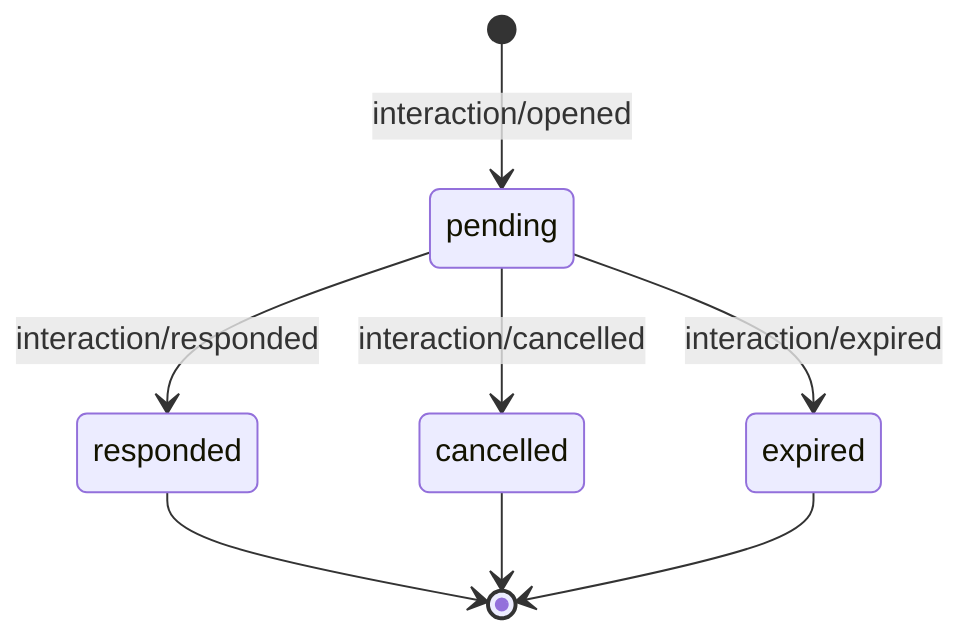

# H05：会话持久交互宿主能力

状态：R05 的插件适配前置任务。2026-09-08 针对发布运行时 `0.1.1-rc.2` 的审计证明该能力缺失；审计证据见 [R05 host API audit](../evidence/r05-host-api-audit.md)。本任务在 DeepSeek Harness 仓库完成并发布后，Harness-plugins 才能开始 R05 的 IPC 与 Lens 集成。

## 目标

让 Harness 而不是任一 UI 拥有一次待审批或待追问交互的身份、状态、答复与持久化事实。Lens、完整 Harness Web 界面和 ACP 等界面只是经过宿主授权的 presenter/provider。用户关闭 Lens、网络断开或进程重启时，待办不会被误写为已批准、已拒绝或已完成。

完成后，Consumer 可以暂停一个正在执行的 Agent 操作，得到稳定的 `interactionId`；授权界面可以按 session 查询待办，且只通过宿主的原子答复操作结算它。一次允许最多执行一次；拒绝、取消、过期和其他客户端抢先答复都有可重建的终态。

## 发现与边界

### 已核实的发布运行时限制

`@deepseek-ai/dsh-user-approval@0.1.1-rc.2` 只有 `ctx.approval.request(request)` 和 `approval/request` waterfall。它把 `approval/asked` 与 `approval/decided` 审计对写入当前 turn，但不向答复者公开 request id，也没有 `listPending()`、`respond()`、`claim()` 或重启恢复入口。

同版本 `@deepseek-ai/dsh-user-questions` 是单 provider 服务：第二次 `registerProvider()` 会抛出 `DUPLICATE_PROVIDER`，并且没有 interaction id、durable event、待办列表或恢复 API。`@deepseek-ai/dsh-permission-presets` 只管理 session 的 sandbox/approval policy，不表示单次待办。

因此，Harness-plugins 不能通过内存 Map、第二个 provider、客户端自造 id 或自动批准来完成 R05。这样会绕过宿主权限、无法跨客户端仲裁，且无法从 session log 恢复。主仓库当前 `0.1.2-rc.1` 的 `user-questions` 已改为 waterfall，但它不是插件 rc.2 profile 可直接调用的发布 API；不能复制其源码作为兼容层。

### 本任务包含

- 一个宿主拥有的 interaction capability seam，提供稳定 identity、待办查询、结算、取消和过期语义。
- `approval` 与 `ask-user` 对这个 seam 的 Consumer 适配。
- 由 durable session events 重建的 session-scoped pending/terminal 状态。
- 一个或多个经过授权的 presenter/provider 如何领取、显示和答复待办的扩展点。
- 并发 first-writer-wins、跨 session/Agent 拒绝、取消、超时、恢复和审计测试。
- TypeScript、Python SDK、session event 文档、profile/bundle composition 与 release 版本同步。

### 本任务不包含

- Lens 的 IPC、Tauri 组件、浏览器采集或客户端缓存实现；这些由 Harness-plugins R05 完成。
- 新的自动批准、持久 allow-always 规则或插件专属权限数据库。
- 将完整选区正文、秘密、令牌或未作决定所需的参数复制到 interaction payload。
- R08 的视觉系统、来源范围扩展或人因研究。

## 必须固定的宿主语义

### 服务与数据模型

建议新增 `ctx.interactions` 服务，包名在宿主目录与公开 catalog 中确定后冻结，例如 `@deepseek-ai/dsh-interactions`。下面是必须保留的语义，不是要求在未审阅前照抄的类型定义：

```ts
type InteractionKind = 'approval' | 'ask-user'
type InteractionState = 'pending' | 'responded' | 'cancelled' | 'expired'

interface PendingInteraction {
  readonly interactionId: InteractionId
  readonly sessionId: SessionId
  readonly agentId: AgentId
  readonly turn: number
  readonly kind: InteractionKind
  readonly toolName?: string
  readonly callId?: CallId
  readonly presentation: SafeInteractionPresentation
  readonly openedAt: number
  readonly expiresAt?: number
  readonly state: 'pending'
}

interface InteractionService {
  open(request: OpenInteractionRequest): Promise<InteractionOutcome>
  list(sessionId: SessionId): Promise<readonly InteractionRecord[]>
  respond(request: RespondInteractionRequest): Promise<SettledInteractionRecord>
  cancel(request: CancelInteractionRequest): Promise<SettledInteractionRecord>
}
```

`InteractionId`、`AgentId`、`SessionId` 与 call id 都是跨边界 opaque id，采用宿主已有的 branded 类型。`presentation` 只含作出决定必要的 tool、动作/原因、有限选项、可安全显示的摘要与到期信息；原始选区材料不进入这个对象。

`open()` 必须在拥有该 Agent 的宿主作用域和可记录的 lifecycle 点创建 interaction。它返回的 Promise 只能由该 interaction 的合法终态结算。`list()` 从 durable log 折叠状态，不从某 UI 的内存表读取。`respond()` 必须验证 interaction 所属 session、Agent scope、回答格式和 presenter/provider 权限；客户端提供的 id 只是选择对象，不能证明它有权答复。

### Durable event 和生命周期

新增 session event 至少表达以下状态转换，并让事件中携带 `interactionId`、session/Agent/turn 关联、kind、最小 presentation、时间与结算原因：



`opened` 只能有一个尚未结算的同 id 记录；每个 `opened` 必须有且仅有一个终态。重复、晚到或跨 session 答复不得增加第二个终态。事件与 `SessionEventMap` 的版本规则、ignorable 策略、TS/Python SDK 投影和 session-query 读取一起演进。

若真实进程在 `pending` 时退出，恢复逻辑必须明确二选一：重新附着可答复的 pending interaction，或在恢复时原子写入 `cancelled`/`expired`。不能把 `opened` 留成没有 live waiter、任何界面也无法安全结算的孤儿记录。

### 原子性、所有权与安全

1. `respond()` 在宿主内对 pending 状态执行一次 compare-and-set；第一位合法 responder 的答复是唯一有效答复。
2. 两个 presenter 同时允许时，工具 body 只能运行一次；第二位 caller 收到稳定的已结算记录，而不是重复执行或通用成功。
3. session B、其他 live Agent、已经 dispose 的 scope、过期 interaction 和 abort 后的答复都必须拒绝或返回已结算终态，绝不改变 session A 的执行。
4. 工具/agent 的 AbortSignal、session cancel、Agent disposal 和 expiry 都必须结算尚未答复的 interaction，并阻止晚到 allow。
5. approval 保持 fail-closed：只有宿主确认的 `allowed-once` 才允许原动作继续。ask-user 的答案在宿主验证 question ids、选项和 custom answer 规则后才返回 Consumer。
6. provider 监听器遵守 Cordis waterfall：未拥有 interaction 时必须调用 `next()`；不能通过 sibling listener 顺序定义权限优先级。

## 实现工作包

### H05-1：能力设计与 session event 注册

目的：先固定 durable 状态和跨语言投影，避免 UI 或 approval Consumer 先产生无法恢复的事实。

实现：在 `packages/interaction/` 建立 Service Definition，声明 branded interaction id、状态联合、最小 presentation schema、`Context` 注入和 `SessionEventMap` 事件。审查 `docs/architecture.md`、`docs/defensive-patterns.md`、session format 规则和现有 approval/question package 的 event JSDoc；必要时新增 monotonic schema version，但不为 pre-release 格式保留兼容 shim。

测试：先写 event round-trip、未知/重复转换拒绝、每个 opened 恰好一个 terminal event、TS/Python projection 的失败用例。运行新包 focused tests、`pnpm run typecheck`、相关 session snapshot/SDK expected-output 测试和 `pnpm run build`。

### H05-2：持久 service、恢复与并发结算

目的：让 pending interaction 的权威状态从 session log 重建，而不是留在 Promise 或 UI 内存中。

实现：服务打开时写 durable `opened`，用 session log fold 提供 `list()`，并用受 session/Agent scope 保护的原子结算路径写 terminal event。恢复路径明确处理 active waiter、超时和取消。不要用全局 mutable Map 作为权威来源；内存等待器只能是已持久 interaction 的暂态投影。

测试：重建 Context/Agent 后读取 pending；两个 responder 竞答；跨 session/Agent 拒绝；重复答复；abort、dispose、session cancel、expiry；commit 失败不返回未记录答复。每个测试断言终态事件和实际 Consumer/工具执行次数。

### H05-3：approval Consumer 迁移

目的：保留已有 approval policy 与 fail-closed 行为，同时让交互 id 对 presenter 可见。

实现：`@deepseek-ai/dsh-user-approval` 通过 interaction service 创建 approval interaction，并由它等待结算。现有 `approval/asked` / `approval/decided` 的模型可见性和审计语义若被 interaction events 替代，必须同步迁移所有 Consumer、invariant、文档、snapshot 与 SDK；不要让同一请求写两套互相漂移的状态。

测试：`ask`、`never`、无 provider、allowed-once、rejected、cancelled、unavailable，以及在工具 `pre-execute` 处未批准前 body 不执行。加多 presenter race 和重启终态测试。

### H05-4：ask-user Consumer 与 provider coexistence

目的：让完整 Harness、Lens 和 ACP 可以安全共存，而不是 rc.2 的单 provider 冲突。

实现：将 `userQuestions.ask()` 转为 interaction Consumer 或通过同一 interaction service 暴露 waterfall provider。保持顶层 live Agent 身份、question/option/custom-answer 验证和 AbortSignal 语义。移除或明确废止单 provider 注册假设；同时维护 profile composition，保证至少一个合适 presenter 能处理任何支持的 interaction。

测试：两个 provider 的受限领取/转交、无 provider fail-closed、`DUPLICATE_PROVIDER` 的旧路径不再是发布 API、ask-user 的问题答案验证、在重启或取消后不接受晚到回答。

### H05-5：session query、presenter 与 profile 装配

目的：让 UI 通过宿主公开 API 恢复准确待办，而不读取 session 文件或拼接事件。

实现：为 session query 或 interaction service 加只读 projection，返回已经脱敏的 pending/terminal records。Web/ACP/Lens presenter 都通过受支持的 endpoint/Remote Events 接入。为 bundle/base patch 和 preset 声明 dependencies，确保 raw `cordis.yml` 插件解析受 manifest 验证。

测试：新建、恢复、切换 session 的 list/read；一个 UI 已答复后其他 UI 刷新为相同终态；profile 启动 smoke；bundle resolver 检查；流程没有因为缺少 UI 而自动允许。

### H05-6：发布、文档与交接

目的：确保 Harness-plugins 只消费真正发布、可装配的 API。

实现：更新 package README、中英文本地化、architecture/interaction 文档、Agent Note、config catalog、TS/Python SDK expected output 和 release metadata。发布包含 Service Definition、Provider、Consumer 三个角色，不能只发布 UI 事件或空 installer。

交接给插件前必须给出：发布包版本、export 路径、profile/bundle fragment、最小可运行 probe、event schema、权限模型、支持的恢复语义、focused test 输出和一个真实 profile 证据 SHA。插件随后把 peer/dev dependency 固定到该发布版本，并从头执行 R05 的协议、Lens 和 real-profile 验收。

## 首批失败用例与验收命令

| 场景 | 初始失败断言 | 完成后的通过条件 |
|---|---|---|
| 可恢复 approval identity | provider 无法取得可答复的 stable id | `open()` 的 interactionId 可经 `list(session)` 找到并由合法 responder 结算 |
| 进程重启 | `opened` 没有可恢复或可终止规则 | 重建后 pending 可继续答复，或已写清晰 terminal event |
| 两个允许答复 | 两个 caller 可能各自继续 body | body 计数为 1；后续答复返回同一 settled record |
| 跨 session 答复 | 客户端提供的 id 可能越权 | session B 答复 A 被拒绝；A 的 body 不运行 |
| 取消后的晚到 allow | 取消与答复竞态可能恢复执行 | terminal cancelled/expired 后 allow 不能启动 body |
| ask-user provider 共存 | rc.2 第二次注册抛 `DUPLICATE_PROVIDER` | 多个 presenter 按 scope/所有权安全领取或转交，且无 provider 仍 fail-closed |

在宿主仓库实现后，命令名以新包 `package.json` 为准；下列命令是必须提供并实际运行的最小验证组合：

```powershell
pnpm --filter @deepseek-ai/dsh-interactions test
pnpm --filter @deepseek-ai/dsh-user-approval test
pnpm --filter @deepseek-ai/dsh-user-questions test
pnpm --filter @deepseek-ai/dsh-tool-ask-user test
pnpm run typecheck
pnpm run test:snapshot -t interaction
pnpm run build
pnpm run doc-sync
git diff --check
```

如果实现中的最终包名不是 `@deepseek-ai/dsh-interactions`，必须在相同提交中替换上述 filter、文档和交接记录；不得把不存在的命令写成已通过。Session event 或 agent-loop 行为改变时，按宿主测试政策补齐 TypeScript 和 Python SDK expected-output，并在同一 PR 运行相应 snapshot。

## 可复制给宿主 Codex 的提示词

```text
在 DeepSeek Harness 主仓库实现 H05：会话持久交互 capability。先读取 AGENTS.md、docs/architecture.md、docs/defensive-patterns.md、packages/AGENTS.md、现有 packages/interaction/user-approval、user-questions、tool-ask-user、session、session-query 和 SDK 测试；确认当前 HEAD、版本与未提交修改。不要从 Harness-plugins rc.2 代码复制接口，也不要为旧格式保留兼容 shim。

新增宿主拥有的 ctx.interactions seam，使 approval 和 ask-user 都能创建有 stable interactionId 的 durable pending interaction。必须提供 session-scoped list、原子 respond、cancel/expiry 与重启规则；events 至少包含 opened/responded/cancelled/expired。UI 只能作为 provider/presenter，不能拥有独立 pending 数据库。对两 UI 竞答使用 first-writer-wins；跨 session/Agent、已取消、已过期和晚到允许必须安全拒绝。approval 保持 fail-closed，ask-user 保持输入验证和 live Agent 身份限制。

先写可恢复 identity、重启结算、两客户端竞答、跨 session、取消晚到答复和 provider coexistence 的失败测试，再做最小实现。SessionEventMap/Agent lifecycle 改动同时更新 TS/Python SDK expected output、snapshot、README、Agent Note、profile/bundle manifest 和 generated docs。运行新包与所有 Consumer 的 focused tests、typecheck、相关 snapshot、build、doc-sync 和 git diff --check；记录实际命令、退出码、发布版本和 profile probe。完成后提供给 Harness-plugins 一个已发布的 package 版本与 API 证据，才开始插件 R05。
```
